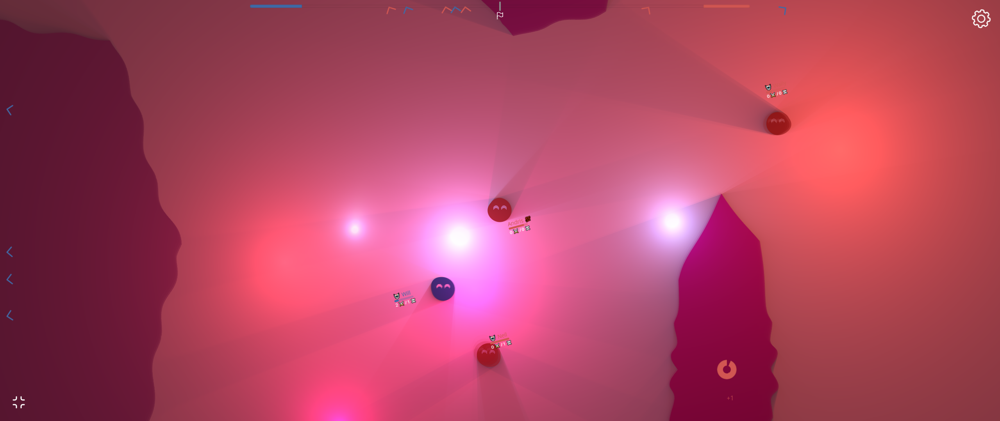
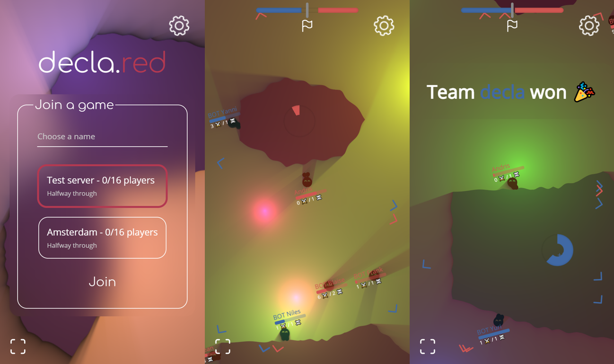

# [decla.red](https://decla.red)

A 2-dimensional multiplayer game utilising ray tracing.

> **Available at [decla.red](https://decla.red).**




For optimised 2D ray tracing, [SDF-2D](https://github.com/schmelczerandras/sdf-2d) is used.

## Deployment

CI/CD runs on Forgejo Actions (`.forgejo/workflows/deploy.yml`). On a push to
`main` it:

- builds the static frontend and rsyncs `frontend/dist/` to the `/pages/declared`
  mount on the runner host, and
- builds the server image from the root `Dockerfile` and pushes it to the Forgejo
  container registry as `<registry>/<owner>/<repo>-server`.

The registry job needs a `FORGEJO_PACKAGE_TOKEN` secret (with package write
scope) and, optionally, a `CONTAINER_REGISTRY_HOST` variable to override the
registry host.

The website's server list is hardcoded in
[`frontend/src/scripts/configuration.ts`](frontend/src/scripts/configuration.ts) —
edit it to add or remove game-server origins.

Run the server image locally:

```sh
docker build -t declared-server .
docker run -p 3000:3000 declared-server --name "My server" --playerLimit 16
```
